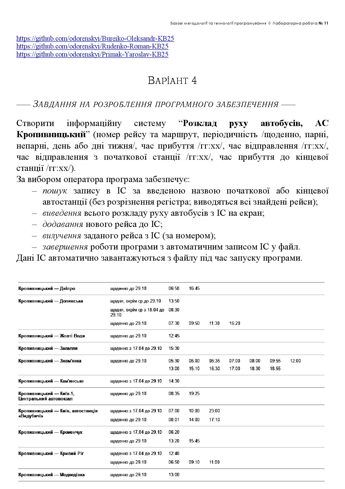

# Лабораторна робота № 11

## Тема
Командна реалізація програмних засобів оброблення динамічних структур даних та бінарних файлів

## Мета
Мета роботи полягає у набутті ґрунтовних вмінь і практичних навичок командної (колективної) реалізації програмного забезпечення, розроблення функцій оброблення динамічних структур даних, використання стандартних засобів С++ для керування динамічною пам’яттю та бінарними файловими потоками.

## Завдання

1. У складі команди ІТ-проєкта розробити програмні модулі оброблення динамічної структури даних. 
2. Реалізувати програмний засіб на основі розроблених командою ІТ-проєкта модулів.

## Варіант № 4

Кропивницький | <a href="http://www.kntu.kr.ua/">ЦНТУ</a> | 2026