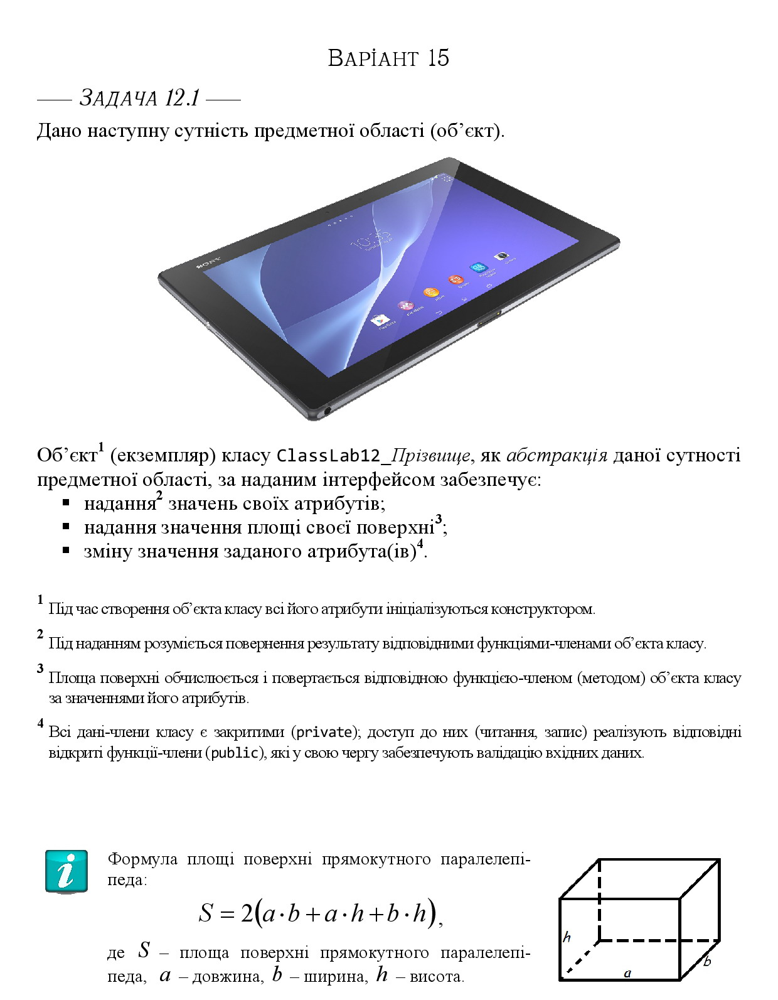

# Лабораторна робота № 12

## Тема
Програмна реалізація абстрактних типів даних

## Мета
Мета роботи полягає у набутті ґрунтовних вмінь і практичних навичок об’єктного аналізу й проєктування, створення класів С++ та тестування їх екземплярів, використання препроцесорних директив, макросів і макрооператорів під час реалізації програмних засобів у кросплатформовому середовищі Code::Blocks. 

## Завдання

1. Розробити клас ClassLab12_Rudenko, який реалізує абстракцію сутності предметної області відповідно до варіанта завдання. 
2. Реалізувати програмний засіб Teacher для модульного тестування об'єкта класу ClassLab12_Rudenko та протоколювання результатів тестування у текстовий файл.

## Варіант № 15

Кропивницький | <a href="http://www.kntu.kr.ua/">ЦНТУ</a> | 2026